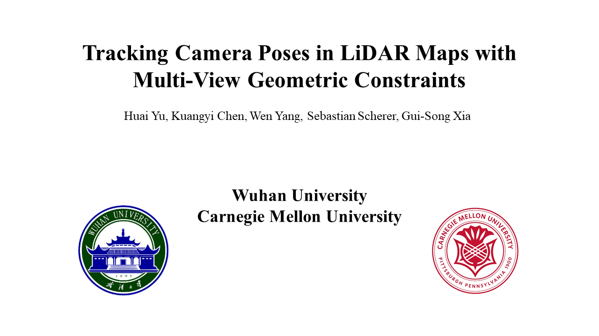

# 2D3DPoseTracking

### Check out our new paper "Tracking Camera Poses in LiDAR Maps with Multi-View Geometric Constraints":
* [Video](https://www.youtube.com/watch?v=oZm4Z-XEeBk)

[](https://www.youtube.com/watch?v=oZm4Z-XEeBk) 

## Demos
Pretrained models can be downloaded from [google drive](https://drive.google.com/file/d/1h41khiqwxY5upBbpVqXaqjBlvRQHYR_e/view?usp=drive_link)

You can demo a trained model on KITTI sequence 00
```Shell
python run_odometry_kitti.py --load_checkpoints ./checkpoints/checkpoints.pth --tight_couple
```

## Acknowledgments
The code is based on [I2D-Loc](https://github.com/EasonChen99/I2D-Loc) and [RAFT](https://github.com/princeton-vl/RAFT).

## Under review
The full source code used in our study will be released upon paper acceptance. 